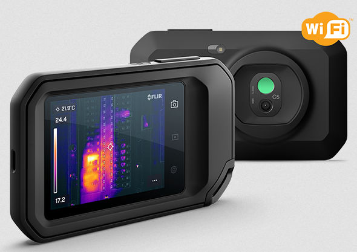

flir-cx
=======

Overview
--------
flir-cx is a github project that contains the open source distribution for
the firmware in [FLIR C5](https://www.flir.eu/products/c5/) infrared camera 
(and its variants).

And now also for [some other FLIR cameras](otherproducts.md); 

#### FLIR C5
The FLIR C5 product (and its variant; FLIR C3x) is based upon a FLIR lepton module for the IR image generation, It also has a visual camera module. Both these image modules are connected to a (FLIR designed) small computer board based upon [i.MX7ULP](https://www.nxp.com/products/processors-and-microcontrollers/arm-processors/i-mx-applications-processors/i-mx-7-processors/i-mx-7ulp-family-ultra-low-power-with-graphics:i.MX7ULP)

Software running on this FLIR board (called ec201) is divided into a M4 part
(closed source) and a A7 part.
The cortex A7 runs linux. 

#### Other FLIR products supported
Besides FLIR C5/C3x, there are a number of other FLIR products that uses the same type of platform.

See [other FLIR products](otherproducts.md)

#### Open source linux parts for supported FLIR cameras
This linux distribution is based upon yocto.

FLIR has added its own yocto layers to the yocto platform

One layer called `meta-flir-base` contains FLIR additions to open source recipes.

(A 2:nd layer `meta-flir-internal` exists within FLIR that contains FLIR private recipes. The repository for this layer is not published on github)

It is fully possible to build and install a working linux platform to the supported products without the
private meta-flir-internal layer. 
How to do this is described on these page(s).

**Note** that there are multiple generations (branches) of this yocto platform. A "master" branch that supports only FLIR C5. And a "yocto3.3" branch that supports multiple FLIR product targets.

On top of the linux platform a closed source FLIR application executes.
It provides a graphical user interface based upon the Qt framework.
This FLIR application is what the normal FLIR C5 (or other supported FLIR product) user interacts with using the LCD with its touch screen.

Which yocto branch to use depends of product to build for, and also the software application release level for that product

Limitations
-----------
The source code in flir-cx is provided 'as is'. It represents the used code in delivered selected FLIR products. 
Updates to these git repos will be made if/when new versions of the software are developed (within a reasonable delay in time.)

Not all source for code used within FLIR product(s) is present, only what is considered 'open'

Closed source licenses apply to:
- Code running within the Cortex M4 part of i.MX7
- A few parts of the linux rootfs platform 
- The camera application code (a large part of the camera software)

These parts are distributed in binary form (at factory) and are installed into the FLIR C5 non-volatile memory ("disk").

Open source for FLIR products is accessed using the [meta-flir-openmanifest](https://github.com/flir-cx/flir-yocto-openmanifest.git) repo (and applying proper commands). 

(**Note**: multiple branches of this repo, select branch matching your product.)

Anyone is allowed to download, study and possibly build artifacts from the provided source.

To be able to install and run the built artifacts on a target device (i.e. FLIR C5), the specific device needs to be 'unlocked'. (see [FLIR unlocker tool](unlock_tool.md))

Download
--------
Depending on product,see 

[meta-flir-openmanifest (master)](https://github.com/flir-cx/flir-yocto-openmanifest.git) (FLIR C5), or

[meta-flir-openmanifest (yocto3.3)](https://github.com/flir-cx/flir-yocto-openmanifest/tree/yocto3.3) (other supported products)

Building toolchain, individual packages or full target images
-------------------------------------------------------------
Provided that source is downloaded locally to a computer suitable for yocto
development, it is possible to build code for a FLIR C5 (or other supported products).

#### yocto 2.5 distribution - FLIR C5
FLIR yocto (2.5) distribution is tested to build on an [Ubuntu](https://ubuntu.com/) host, ubuntu 14 or ubuntu 16 .
Ubuntu 18 will most likely run into build problem(s), and is not recommended directly. Ubuntu 20 is untested.
Other linux distributions (that supports yocto development) might work, but is not tested. Other operating systems than linux (Windows, Apple OS...) could work using the docker build environment presented below. Not tested.

#### yocto 3.3 distribution - other supported FLIR products
FLIR yocto (3.3) distribution is tested to build on an [Ubuntu](https://ubuntu.com/) host, ubuntu 18 or ubuntu 20. Earlier ubuntu host distibutions will probably fail.
Ubuntu 22 will fail.

Other linux distributions (that supports yocto development) might work, but is not tested. Other operating systems than linux (Windows, Apple OS...) could work using the docker build environment presented below. Not tested.

#### local host based build 
(see above regarding ubuntu distribution level)
- Make sure that your local host has all the necessary additional .deb (or .rpm) packages installed (see relevant yocto documentation, yocto 2.5 - "Sumo" or yocto 3.3 - "Hardknott")
- Create a local build environment and download code as described by [meta-flir-openmanifest](https://github.com/flir-cx/flir-yocto-openmanifest.git)
- Proceed as stated below "common procedure"
 

#### docker based build - recommended 
To isolate host distribution dependencies, a [docker](https://en.wikipedia.org/wiki/Docker_(software)) image is provided (part of this documentation repository) as a *Dockerfile* 
See [flir-yocto-builder docker](docker/flir-yocto-builder/README.md) for usage. 
The Dockerfile could be used to generate build containers for various ubuntu distribution versions. The containers will have necessary, additional .deb packages (needed for a yocto build) preinstalled.

To use it for building:
- Install docker environmant on your local host
- Build a *flir-yocto-builder* container with selected ubuntu version as described by [flir-yocto-builder docker](docker/flir-yocto-builder/README.md).
- Create a local build environment and download code as described by [meta-flir-openmanifest](https://github.com/flir-cx/flir-yocto-openmanifest.git) (note, select suitable branch)
- Start *flir-yocto-builder* container while in root of local build environment as described by link above (use suitable docker flags).
- Proceed as stated by "common procedures"

#### common procedure
First, the local build environment needs to be initiated.
Run (while in root of local build environment):
~~~console
MACHINE=ec201 source ./flir-setup-release.sh -b build_ec201
~~~
(creates sub folder *build_ec201* if not present before and initiates it. First time you need to approve a license agreement. "current working directory" will also be set to _build_ec201_ )

(replace *ec201* with other board if ec201 is not the board you are building for)

Now it is possible to build code for the "ec201" using *bitbake* commands. Implicitely needed artifacts will be built when needed. 
Main build target would be *flir-image*. (i.e. *bitbake flir-image*) for yocto2.5/ec201 (previously *flir-image-sherlock*). This recipe will build almost all components, including the linux kernel and a standard populated rootfs.

(When using yocto3.3 branch, the main build target will be *flir-image*)

Note that the disk space requirements for a build is quite large. 
**70 GB** additional space is a **minimum** (!). 
Other targets than *flir-image* might be built. Study the yocto source tree.
If returning to the project later on, or in another session, you may instead run command:
~~~console
source setup-environment build_ec201
~~~
Difference is that eventual changes to *conf/local.conf* are kept in this case

Target connection
-----------------
To download and execute generated code on a FLIR target, A USB connection is recommended. 
Wi-Fi is also supported, See [WiFi backup-connection to target device](backup-connection.md) 

#### Warning:
Note: To access the FLIR C5 (or other supported product) device as a developer, you will need to [_**unlock**_](unlock_tool.md) the device. Even if possible, this is **NOT** recommended. 
You will be on your own, product warranty will be limited. 
FLIR cannot take responsibility for the software quality anymore if uncontrolled software has been installed onto the device. Even if nothing is installed, this will be impossible to tell if the device has been unlocked.

#### Connection:
If you still want to connect to your device as a developer, please read more in [USB RNDIS and shell connection](rndis.md) 

Target software disk layout
---------------------------
The "disk" on the ec201 board is actually a 4 GB eMMC. The same is true for the *ec302* and *evco* boards.
*eoco* board eMMC is 8 GB and *ec702* is 16 GB. Basic layout for these boards are the same, the storage partition is just larger.

This "disk" is partitioned as:

~~~console
eMMC layout:
-------------------------------------------------------------------------------------------------------------------------------------
| u-boot | u-boot env | recovery | rootfs1 | rootfs2 | rootfsrw | apps, /FLIR/usr | data, /FLIR/system | storage, /FLIR/images      |
-------------------------------------------------------------------------------------------------------------------------------------
                        ^                                                                               ^
                        |                                                                               |
                       mmcblk0 ...                                                                     mmcblk7 
		       
root@ec201-0A13DC:~# parted /dev/mmcblk0 print
Model: MMC 004GA0 (sd/mmc)
Disk /dev/mmcblk0: 3959MB
Sector size (logical/physical): 512B/512B
Partition Table: gpt
Disk Flags: 

Number  Start   End     Size    File system  Name      Flags
 1      2097kB  44.0MB  41.9MB  fat16        recovery  msftdata
 2      44.0MB  581MB   537MB   ext4         rootfs1   msftdata
 3      581MB   1118MB  537MB   ext4         rootfs2   msftdata
 4      1118MB  1252MB  134MB   ext4         rootfsrw  msftdata
 5      1252MB  1789MB  537MB   ext4         apps      msftdata
 6      1789MB  2326MB  537MB   ext4         data      msftdata
 7      2326MB  3959MB  1634MB  ext4         storage   msftdata

root@ec201-0A13DC:~#
root@ec201-0A13DC:~# mount | grep -e mmc -e " / "
/dev/mmcblk0p4 on /aufs/rwfs type ext4 (rw,relatime,data=ordered)
/dev/mmcblk0p3 on /aufs/rofs type ext4 (ro,relatime,data=ordered)
none on / type overlay (rw,relatime,lowerdir=/tmp/aufs/rofs,upperdir=/tmp/aufs/rwfs/upper,workdir=/tmp/aufs/rwfs/workdir)
/dev/mmcblk0p5 on /FLIR/usr type ext4 (rw,noatime,data=ordered)
/dev/mmcblk0p6 on /FLIR/system type ext4 (rw,noatime,data=ordered)
/dev/mmcblk0p7 on /FLIR/images type ext4 (rw,relatime,data=ordered)
/dev/mmcblk0p7 on /srv/sftp type ext4 (rw,relatime,data=ordered)
root@ec201-0A13DC:~# 
~~~
Note that the root filesystem ("none on / ") is mounted as an overlay file system. 
Partition 2 and 3 contains 2 versions of a readonly .ext4 image (from flir-image).  
On top of this there is a "overlay" "rw" file system that contains changes to the base image. 
/FLIR mount points contains FLIR camera application + data (closed source). 
Please do not touch content within these folders deliberately, except content below /FLIR/images (or /FLIR/internal) that could be considered "open"
For some targets, the mounted name for partition /dev/mmcblk0p7 might be "/FLIR/internal" instead of "/FLIR/images"
This is true for devices that are equipped with a physical SDcard for user file storage (i.e. images or video clips). Typically FLIR Exx, FLIR Txxx, FLIR G-Series

Installable software components
-------------------------------
From within yocto, it is possible to build "all" the open source content intended for the product board. 

All software pre-populated into _flir-image_(or flir-image-sherlock) is rebuildable using https://github.com/flir-cx/flir-yocto-openmanifest  
It is possible to replace single or multiple package(s), or even replace the complete rootfs (and/or u-boot bootloader) in your device using the techniques described in this document collection. 

Specifically this is true for GPLv3/LGPLv3 licensed packages. 
(Typically _umtp_responder_, _bash_ shell and _Qt libraries_.) 

To find out which packages are really installed into _flir-image-sherlock / flir-image_ (and thus replaceable), generate your own package database using information as described by: [package management addition to rootfs](package-management-addition.md). 

#### rootfs
As indicated, build of a "flir-image" ("flir-image-sherlock") will generate an artifact (_*.ext4_) that could be used to replace the complete base image within rootfs1/rootfs2.
This image file will contain a linux kernel, device tree and a populated rootfs.

See [replace-rootfs](replace-rootfs.md) for details. 
However, replacing the complete rootfs is **NOT** recommended (even if it technically has been tested at FLIR and "should" work).
- You will lose the non-public parts of the rootfs. 
- If your generated binary .ext4 file is "bad", or if installation fails for some reason, it is likely that you will brick your device.

#### u-boot
Will be generated implicitely by running _bitbake flir-image_/ flir-image-sherlock or by explicitely running: _bitbake u-boot_ 
See [replace-u-boot](replace-u-boot.md) for details. 
However, replacing u-boot is **NOT** recommended (even if it technically has been tested at FLIR and "should" work).
- If your generated binary u-boot.imx file is "bad", wrong file used or if installation fails for some reason, it is likely that you will brick your device.

#### rootfs installable packages
rootfs as defined by _flir-image_ (/ flir-image-sherlock) contains a large number of various packages.  For details, see source files in _meta-flir-base_ 
The file _meta-flir-base/conf/distro/flir.conf_ declares: _PACKAGE_CLASSES = "package_ipk"_ as opposed to "rpm"). 
This means that the packages that are built within the flir-yocto environment will generate components in the format ".ipk". 

_flir-image_ (among other packages) contains a package called _okpg_. 
opkg is a utility to manage installation/removal of (.opk/.ipk) packages in runtime. 
(Brief background could be found for instance [here](https://en.wikipedia.org/wiki/Opkg).)  
With opkg, package installation state is kept in a "database" inside the rootfs at _/var/lib/opkg_ (text based). 
Even if would be possible to pre-populate this database with all packages installed into _flir-image_ at build time, FLIR selected to skip this prepopulation (!). 
The reason is that this "database" will take a significant part of the disk space. For _flir-image_ the required space for a populated opkg database would be around 7 MB. 

If you connect to a (unlocked, not manipulated) FLIR C5 camera and try command _opkg list_ you would typically find 2 installed packages;
~~~console
root@ec201-0A13DC:~# opkg list
appkit - 1.0.5-r280860
prodkit - 1.0.3.15-r280286
root@ec201-0A13DC:~#
~~~
These 2 packages are added on top of the installed rootfs, thus visible. 
(Occupied disk space for the opkg database is now ~60K.)

To add/check what a pre-populated opkg database would look like, you may want to look at [package management addition to rootfs](package-management-addition.md). 

##### Installing/replacing packages in device
See [Working with packages](working-with-packages.md) about building and installing ipk packages to your target. 

#### Non open source parts of FLIR C5 / other FLIR product
Note that the "camera application" that makes the FLIR product work as an infrared camera is **NOT** open source. 
You are not allowed to try to manipulate any files within folders _/FLIR/usr_ and/or _/FLIR/system_ (_/FLIR/images_ is OK). 
Failure to follow this guideline will be a license violation to the "flir application". 
That said, feel free to manipulate other files in the root file system (at your own responsibility) or just use the provided information for educational purposes.
