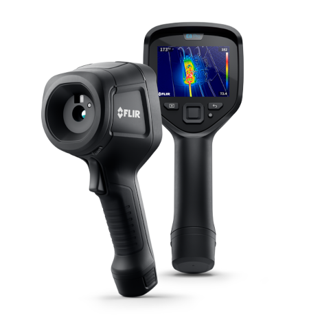
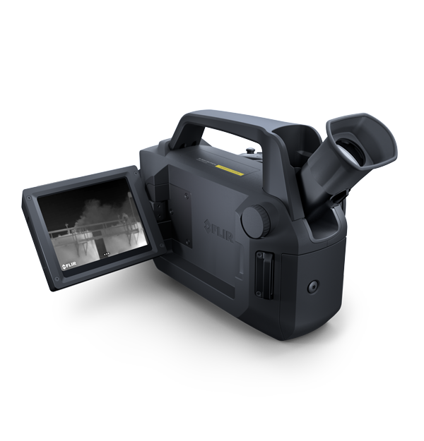

Other FLIR products supported
=============================

  

Camera products
---------------
#### FLIR E8 Pro
[FLIR E8 Pro](https://www.flir.eu/products/e8-pro/) (and its variants).

The FLIR E8 Pro product is based upon a not publically available FLIR detector (+ a fpga) to provide the IR image generation. 

It also has a visual camera module. 

Both these image modules are connected to a (FLIR designed) small computer board also based upon [i.MX7ULP](https://www.nxp.com/products/processors-and-microcontrollers/arm-processors/i-mx-applications-processors/i-mx-7-processors/i-mx-7ulp-family-ultra-low-power-with-graphics:i.MX7ULP).

Software running on this FLIR board (called ec302) is divided into a M4 part
(closed source) and a A7 part.
The cortex A7 runs linux. 

#### FLIR G-Series
[FLIR G-Series](https://www.flir.eu/products/flir-g_series) with several variants 

FLIR G-Series cameras are primarily used for various gas detection. Gases that are invisible to the naked eye could be visible in the infrared spectrum.

The FLIR G-Series products are based upon a cooled detector. Specific details about detector varies between the different G-Series models. Detector is 320x240 or 640x480.
These cameras also contain a visual camera module. Both these image modules are connected to a (FLIR designed) small computer board based upon a fpga and a [i.MX6Dual](https://www.nxp.com/products/processors-and-microcontrollers/arm-processors/i-mx-applications-processors/i-mx-6-processors/i-mx-6dual-processors-dual-core-3d-graphics-hd-video-multimedia-arm-cortex-a9-core:i.MX6D) 

The G-Series also has an external SDcard where image/video files are stored..

Software is running on this FLIR board (called eoco). The software runs using linux.

(Note that there exists an older generation of FLIR G-Series. The software for this older generation is not running linux and is NOT supported by FLIR open source distribution.)
