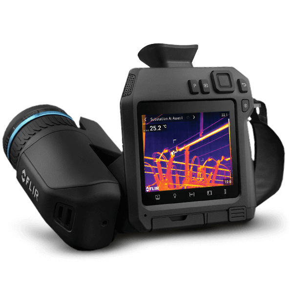
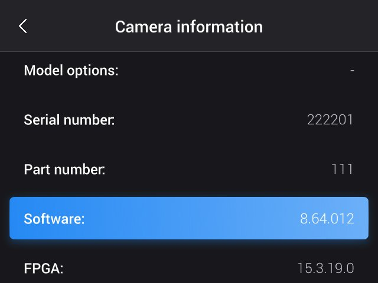

Other FLIR products supported
=============================

* [FLIR Scout Pro](#scoutpro)
* [FLIR E8 Pro](#e8pro)
* [FLIR G-series](#gseries)
* [FLIR T8xx / FLIR T5xx / FLIR Exx / GF77](#t5t8gf77)

Camera products
---------------

#### FLIR Scout Pro
[FLIR Scout Pro](https://www.flir.eu/products/scout-pro/)

FLIR Scout Pro is a series of monocular cameras intended for law enforcement and public safety situations.

The system control board, called ec702, consists of an uncooled 30Hz 640x480 detector, an Intel FPGA and an [i.MX6Dual](https://www.nxp.com/products/processors-and-microcontrollers/arm-processors/i-mx-applications-processors/i-mx-6-processors/i-mx-6dual-processors-dual-core-3d-graphics-hd-video-multimedia-arm-cortex-a9-core:i.MX6D) MPU. There is no visual camera.

Software for the ec702 board runs on a Linux system and is bootstrapped by U-Boot.

#### FLIR E8 Pro
[FLIR E8 Pro](https://www.flir.eu/products/e8-pro/) (and its variants).

The FLIR E8 Pro product is based upon a not publically available FLIR detector (+ a fpga) to provide the IR image generation. 

It also has a visual camera module. 

Both these image modules are connected to a (FLIR designed) small computer board also based upon [i.MX7ULP](https://www.nxp.com/products/processors-and-microcontrollers/arm-processors/i-mx-applications-processors/i-mx-7-processors/i-mx-7ulp-family-ultra-low-power-with-graphics:i.MX7ULP).

Software running on this FLIR board (called ec302) is divided into a M4 part
(closed source) and a A7 part.
The cortex A7 runs linux. 

#### FLIR G-Series
[FLIR G-Series](https://www.flir.eu/products/flir-g-series) with several variants 

FLIR G-Series cameras are primarily used for various gas detection. Gases that are invisible to the naked eye could be visible in the infrared spectrum.

The FLIR G-Series products are based upon a cooled detector. Specific details about detector varies between the different G-Series models. Detector is 320x240 or 640x480.
These cameras also contain a visual camera module. Both these image modules are connected to a (FLIR designed) small computer board based upon a fpga and a [i.MX6Dual](https://www.nxp.com/products/processors-and-microcontrollers/arm-processors/i-mx-applications-processors/i-mx-6-processors/i-mx-6dual-processors-dual-core-3d-graphics-hd-video-multimedia-arm-cortex-a9-core:i.MX6D) MPU 

The G-Series also has an external SDcard where image/video files are stored..

Software is running on this FLIR board (called eoco). The software runs using linux.

(Note that there exists an older generation of FLIR G-Series. The software for this older generation is not running linux and is NOT supported by FLIR open source distribution.)

#### FLIR T8xx / FLIR T5xx / FLIR Exx / GF77
[FLIR T865](https://www.flir.eu/products/t865/),[FLIR T560](https://www.flir.eu/products/t560/), [FLIR T540](https://www.flir.eu/products/t540/) are examples of FLIR Txxx cameras

[FLIR E96](https://www.flir.eu/products/e96/), [FLIR E86](https://www.flir.eu/products/e86/), [FLIR E54](https://www.flir.eu/products/e54/) are examples of FLIR Exx cameras

[FLIR GF77](https://www.flir.eu/products/gf77/) is a "gas" variant of T5xx (special detector)

  

These cameras are based on different variants of an uncooled IR detector. 

Specific details about detector varies between the different models. Detector resolution varies from 320x240 to 640x480 (model dependent).
These cameras also contain a visual camera module. Both these image modules are connected to a (FLIR designed) small computer board based upon a fpga and a [i.MX6Solo](https://www.nxp.com/products/processors-and-microcontrollers/arm-processors/i-mx-applications-processors/i-mx-6-processors/i-mx-6solo-processors-single-core-multimedia-3d-graphics-arm-cortex-a9-core:i.MX6S) MPU

The Txxx/Exx cameras has an external SDcard where image/video files are stored..

Software is running on a FLIR board (called evco). The software installed is based upon linux.

Historically there is an earlier generation of the software which is NOT supported by this open source distribution (still running linux).

You can check your installed version if you navigate to the menu "Settings" - "Device settings" - "Camera information"
Look for the field "Software"

Only the late software identified as >= 8.x.x is supported by this documentation.

All cameras delivered are possible to upgrade to this generation, contact [FLIR support](https://flir.custhelp.com/)
