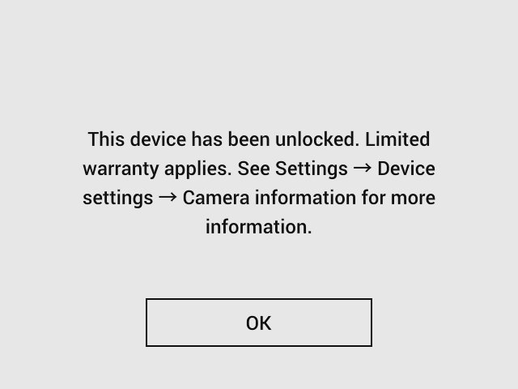

FLIR unlocker tool
==================

Purpose
-------
To make it possible to login as _root_ to a FLIR C5 device to be able to modify it freely.

Distribution
------------
Unlock tool consists of a serial number specific "installer" package. (A _.run_ file). 
This installer will only do its work when installed into the camera with that specific (FLIR C5 camera) serial number. 
Trying to install it into another camera will fail. 
Trying to modify the _.run_ file and install into any camera will fail - file is digitally signed.

Unlock caveat
-------------
**Note:** Although it is possible to unlock a (FLIR Cx) device for development, it is **NOT** recommended. 
By unlocking the device, **warranty will be limited**, even if no additional steps to change software content is taken. 
Although it should be possible to re-lock the device by a certified FLIR service center, this will come at a charge.

How to get an unlocker tool for your FLIR C5 device
---------------------------------------------------
Contact [FLIR custhelp](request_tool.md) and request a "FLIR C5 unlocker tool" 
Provide your personal data and your camera serial number. 

You should receive a special installer file attached to an email. 
This attachment should be able of "unlocking" the FLIR Cx specific serial number device as described on this page. 

Typical file name; _FLIR_oss_unlocker_1.2_894001234.run_ 

Limitations
-----------
To get the right to use the unlock tool, the connected [license](LICENSE_unlocktool.txt) require that you do not intentionally remove any FLIR target markers installed by the tool.
Such marker(s) makes it possible for FLIR camera application to check whether the device is "unlocked". 

Comment: 
The marker used will be placed in device non-volatile memory in a position not disturbing the camera operation. 
Nor any reasonable alternative usage of the device.

Usage
-----
- Connect camera to a (linux or Windows) PC host using USB cable.
- Open _FLIR camera_ file system in a file browser on your host PC. 
  (_FLIR camera_ should be visible from the PC as it is expected to use usbmode MTP).
- Browse to camera folder _FLIR Camera - Images - doupdate_ 
(on other cameras than FLIR C5, the folder might be: _FLIR Camera - Internal - doupdate_ )
- Drag / drop your received unlocker file ( _FLIR_oss_unlocker_1.2\_\<serial\>.run_) into this folder (from another file browser instance) 
  The unlocker file will now automatically be installed. 
  (There is a short instruction file in this location (_doupdate_) if you like to read more about this)
- (Do not try to install an unlocker .run file intended for another serial number. Installation will then fail)

**Note:** [Unlock caveat](unlock_tool.md#unlock-caveat) - Do you understand the implications?

After successful installation of unlocker file, RNDIS (+MTP) will then be set as USB mode in the FLIR C5 unit (until a factory default is performed).

The root password is **temporarily** set to **0pened** (character "zero" instead of letter capital "O", followed by "pened") - valid until device is rebooted.

Login and set permanent own password
------------------------------------
Now connect to the camera device on _ssh_ using either using the newly established USB RNDIS connection (see [USB RNDIS and shell connection](rndis.md) or on Wi-Fi see [WiFi backup connection to target device](backup-connection.md). 
(You need a ssh client installed on your host PC to do this).

- Check ip connection 
  _ping \<camera ip\>_
  (In this example \<camera ip\> is 192.168.250.2)
  _ping 192.168.250.2_
- connect to target using ssh; 
  _ssh root@192.168.250.2_
- You are expected to get a login prompt; 
  _root@192.168.250.2's password:_ 
  Enter: _0pened_ 
  You are now supposed to get a shell prompt, typically; 
  _root@ec201-0D26AC:~#_ 
  (hex digits are device MAC adress dependent)
- Note that the root password ( _0pened_) is temporary and will be restored
  to device specific at reboot unless you now take some action 
  (it is always possible to reinstall the unlocker file).
- Setting own password (run commands in camera device ssh session): 
  _umount /etc/shadow_ 
  _passwd_ 
  (enter own root password - as prompted, twice  
  You should get a success message) 
  _sync_ 
  _reboot_ 

Check connection
----------------
After reboot, check that you are able to login using ssh to root@192.168.250.2 and **your own** root password every time.

Camera application will show a message box every time the camera is rebooted: 
 
Pressing OK will remove the message. 
Camera application will then work exactly as in a factory configured FLIR C5.
